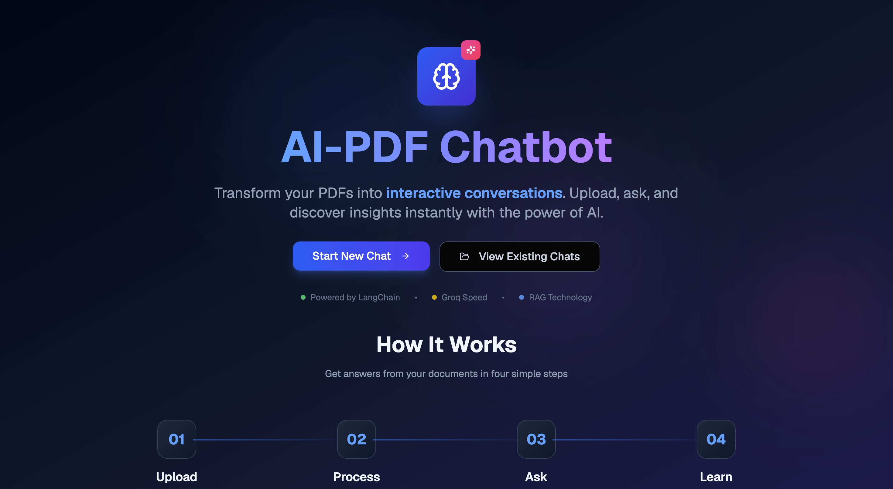
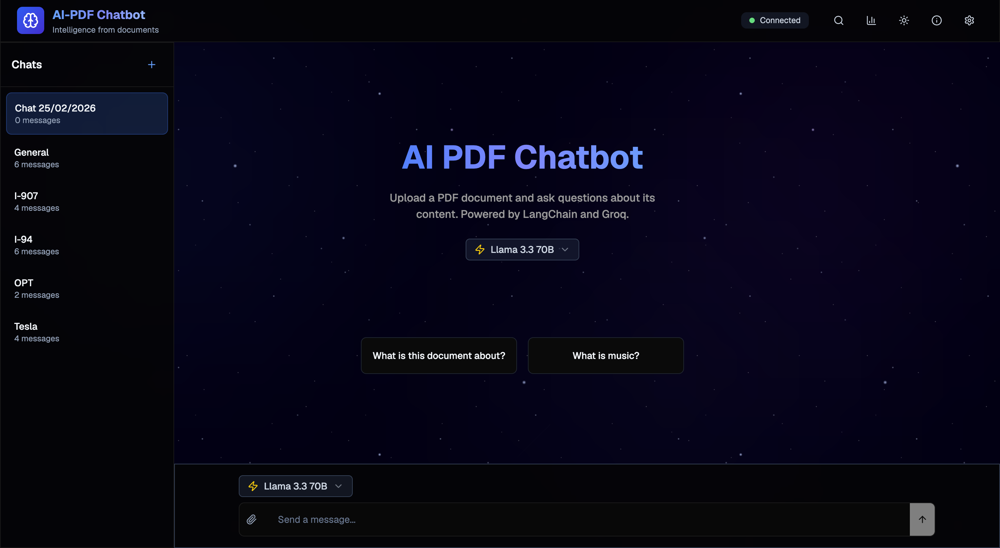
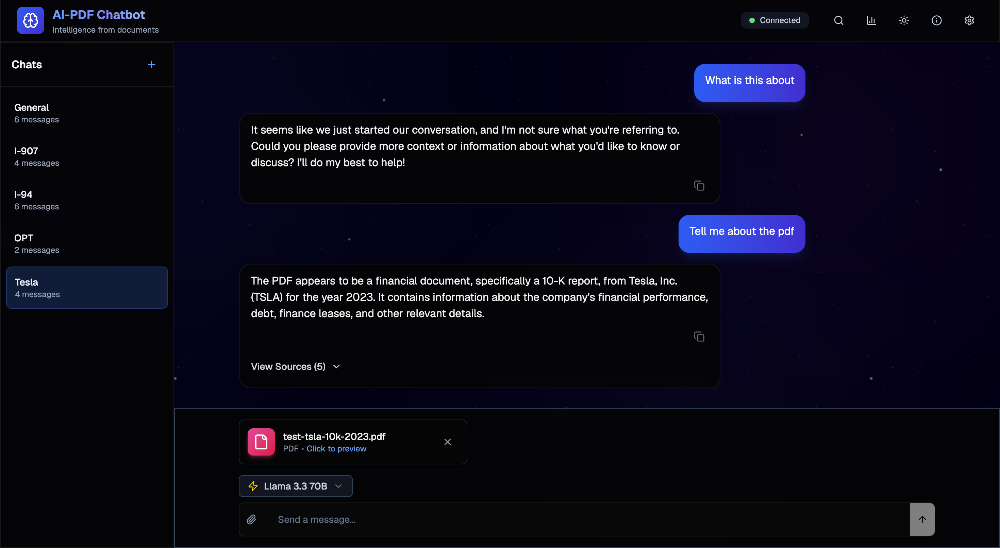

# AI PDF Chatbot & Agent Powered by LangChain and LangGraph and Supabase

This monorepo is a customizable template example of an AI chatbot agent that "ingests" PDF documents, stores embeddings in a vector database (Supabase), and then answers user queries using Groq-powered Llama models with LangChain and LangGraph as orchestration frameworks.

This template is also an accompanying example to the book [Learning LangChain (O'Reilly)](https://www.oreilly.com/library/view/learning-langchain/9781098167271): Building AI and LLM applications with LangChain and LangGraph.

**Developed by Nischith Adavala**

## Screenshots

| Landing Page | Chat Interface | Chat |
|:---:|:---:|:---:|
|  |  |  |

## Table of Contents

1. [Features](#features)
2. [AI Models](#ai-models)
3. [Architecture Overview](#architecture-overview)
4. [Prerequisites](#prerequisites)
5. [Installation](#installation)
6. [Supabase Setup](#supabase-setup)
7. [Environment Variables](#environment-variables)
   - [Frontend Variables](#frontend-variables)
   - [Backend Variables](#backend-variables)
8. [Local Development](#local-development)
   - [Running the Backend](#running-the-backend)
   - [Running the Frontend](#running-the-frontend)
9. [Usage](#usage)
   - [Uploading/Ingesting PDFs](#uploadingingesting-pdfs)
   - [Asking Questions](#asking-questions)
   - [Viewing Chat History](#viewing-chat-history)
10. [Production Build & Deployment](#production-build--deployment)
11. [Customizing the Agent](#customizing-the-agent)
12. [Troubleshooting](#troubleshooting)
13. [Next Steps](#next-steps)

---

## Features

### Core Features
- **Document Ingestion Graph**: Upload and parse PDFs into `Document` objects, then store vector embeddings into a vector database (we use Supabase in this example).
- **Retrieval Graph**: Handle user questions, decide whether to retrieve documents or give a direct answer, then generate concise responses with references to the retrieved documents.
- **Streaming Responses**: Real-time streaming of partial responses from the server to the client UI.
- **LangGraph Integration**: Built using LangGraph's state machine approach to orchestrate ingestion and retrieval, visualise your agentic workflow, and debug each step of the graph.

### UI Features
- **Modern Dark Theme**: Beautiful dark-themed interface with smooth animations and glass-effect styling.
- **Multi-Chat Support**: Create, switch between, rename, and delete multiple chat sessions.
- **Pin Chats**: Pin important conversations to keep them at the top of your chat list.
- **Model Switching**: Choose between different AI models (Llama 3.3 70B for best quality, Llama 3.1 8B for fast responses).
- **Chat Sidebar**: Organized sidebar showing all chats with message counts and quick actions.
- **Search Functionality**: Search across all your chats with keyboard shortcut (⌘K / Ctrl+K).
- **Export Chats**: Export all conversations as JSON for backup or analysis.
- **Stats & Analytics**: View usage statistics including total chats, messages, and documents.
- **Notifications**: In-app notification system for upload progress and status updates.
- **Landing Page**: Beautiful about page with feature showcase and quick access to existing chats.
- **Keyboard Shortcuts**: Efficient navigation with keyboard shortcuts throughout the app.
- **File Preview**: Preview uploaded PDFs before and during conversations.
- **Example Prompts**: Quick-start prompts to help users begin conversations.

---

## AI Models

This application uses **Groq** for blazing-fast inference with the following models:

| Model | Parameters | Best For | Description |
|-------|------------|----------|-------------|
| **Llama 3.3 70B** | 70 Billion | PDF Analysis | Recommended for complex document analysis, multi-document reasoning, and detailed Q&A. Best quality responses. |
| **Llama 3.1 8B** | 8 Billion | Quick Questions | Fast responses for simple queries. Limited PDF analysis capability - best for general questions. |

You can switch between models using the model selector dropdown in the chat interface.

---

## Architecture Overview

```
┌─────────────────────┐    1. Upload PDFs    ┌───────────────────────────┐
│Frontend (Next.js)   │ ────────────────────> │Backend (LangGraph)       │
│ - React UI w/ chat  │                      │ - Ingestion Graph         │
│ - Upload .pdf files │ <────────────────────┤   + Vector embedding via  │
└─────────────────────┘    2. Confirmation   │     SupabaseVectorStore   │
                           (storing in DB)   └───────────────────────────┘

┌─────────────────────┐    3. Ask questions  ┌───────────────────────────┐
│Frontend (Next.js)   │ ────────────────────> │Backend (LangGraph)       │
│ - Chat + SSE stream │                      │ - Retrieval Graph         │
│ - Display sources   │ <────────────────────┤   + Chat model (Groq)     │
└─────────────────────┘ 4. Streamed answers  └───────────────────────────┘
```

**Tech Stack:**
- **Supabase** - Vector store for document embeddings and retrieval
- **Groq** - LLM inference with Llama models (blazing-fast)
- **LangGraph** - Orchestrates the graph steps for ingestion, routing, and responses
- **LangChain** - Framework for building LLM applications
- **Next.js 14** - React framework powering the frontend UI
- **Tailwind CSS** - Styling with custom dark theme
- **TypeScript** - Type-safe code throughout

The system consists of:
- **Backend**: A Node.js/TypeScript service that contains LangGraph agent "graphs" for:
  - **Ingestion** (`src/ingestion_graph/`) - handles indexing/ingesting documents
  - **Retrieval** (`src/retrieval_graph/`) - question-answering over the ingested documents
  - **Configuration** (`src/shared/configuration.ts`) - handles configuration for the backend API including model providers and vector stores
- **Frontend**: A Next.js/React app that provides a web UI for users to upload PDFs and chat with the AI.

---

## Prerequisites

1. **Node.js v18+** (we recommend Node v20).
2. **Yarn** (or npm, but this monorepo is pre-configured with Yarn).
3. **Supabase project** (if you plan to store embeddings in Supabase; see [Setting up Supabase](https://supabase.com/docs/guides/getting-started)).
   - You will need:
     - `SUPABASE_URL`
     - `SUPABASE_SERVICE_ROLE_KEY`
     - A table named `documents` and a function named `match_documents` for vector similarity search (see [Supabase Setup](#supabase-setup) below).
4. **Groq API Key** - Get your free API key from [Groq Console](https://console.groq.com/).
5. **OpenAI API Key** (for embeddings) - Required for generating vector embeddings.
6. **LangChain API Key** (optional but recommended) - For debugging and tracing. Learn more [here](https://docs.smith.langchain.com/administration/how_to_guides/organization_management/create_account_api_key).

---

## Installation

1. **Clone** the repository:

   ```bash
   git clone https://github.com/mayooear/ai-pdf-chatbot-langchain.git
   cd ai-pdf-chatbot-langchain
   ```

2. **Install dependencies** (from the monorepo root):

   ```bash
   yarn install
   ```

3. **Configure environment variables** in both backend and frontend. See `.env.example` files for details.

---

## Supabase Setup

Run the following SQL commands in your Supabase SQL Editor to set up the vector store:

### 1. Enable the Vector Extension

```sql
create extension if not exists vector;
```

### 2. Create the Documents Table

```sql
-- Create a table to store your documents
create table documents (
  id bigserial primary key,
  content text, -- corresponds to Document.pageContent
  metadata jsonb, -- corresponds to Document.metadata
  embedding vector(384) -- 384 dimensions for the embedding model
);
```

### 3. Create the Match Documents Function

```sql
-- Create a function to search for documents
create or replace function match_documents (
  query_embedding vector(384),
  match_count int default 10,
  filter jsonb default '{}'::jsonb
) returns table (
  id bigint,
  content text,
  metadata jsonb,
  similarity float
) language plpgsql as $$
begin
  return query
  select
    documents.id,
    documents.content,
    documents.metadata,
    1 - (documents.embedding <=> query_embedding) as similarity
  from documents
  where documents.metadata @> filter
  order by documents.embedding <=> query_embedding
  limit match_count;
end;
$$;
```

### 4. (Optional) Create Threshold-Based Match Function

```sql
-- Alternative function with similarity threshold
create or replace function match_documents_threshold (
  query_embedding vector(384),
  match_threshold float,
  match_count int default 10
) returns table (
  id bigint,
  content text,
  metadata jsonb,
  similarity float
) language plpgsql as $$
begin
  return query
  select
    documents.id,
    documents.content,
    documents.metadata,
    1 - (documents.embedding <=> query_embedding) as similarity
  from documents
  where 1 - (documents.embedding <=> query_embedding) > match_threshold
  order by documents.embedding <=> query_embedding
  limit match_count;
end;
$$;
```

> **Note**: If you need to change the embedding dimensions later, run:
> ```sql
> ALTER TABLE documents DROP COLUMN IF EXISTS embedding;
> ALTER TABLE documents ADD COLUMN embedding vector(NEW_DIMENSION);
> ```
> Then recreate the match functions with the new dimension.

---

## Environment Variables

The project relies on environment variables to configure keys and endpoints. Each sub-project (backend and frontend) has its own `.env.example`. Copy these to `.env` and fill in your details.

### Frontend Variables

Create a `.env` file in frontend:

```bash
cp frontend/.env.example frontend/.env
```

```env
NEXT_PUBLIC_LANGGRAPH_API_URL=http://localhost:2024
LANGCHAIN_API_KEY=your-langsmith-api-key-here # Optional: LangSmith API key
LANGGRAPH_INGESTION_ASSISTANT_ID=ingestion_graph
LANGGRAPH_RETRIEVAL_ASSISTANT_ID=retrieval_graph
LANGCHAIN_TRACING_V2=true # Optional: Enable LangSmith tracing
LANGCHAIN_PROJECT="pdf-chatbot" # Optional: LangSmith project name
```

### Backend Variables

Create a `.env` file in backend:

```bash
cp backend/.env.example backend/.env
```

```env
# Required API Keys
GROQ_API_KEY=your-groq-api-key-here

# Supabase Configuration
SUPABASE_URL=your-supabase-url-here
SUPABASE_SERVICE_ROLE_KEY=your-supabase-service-role-key-here

# Optional: LangSmith Tracing
LANGCHAIN_TRACING_V2=true
LANGCHAIN_PROJECT="pdf-chatbot"
```

**Explanation of Environment Variables:**

| Variable | Description |
|----------|-------------|
| `NEXT_PUBLIC_LANGGRAPH_API_URL` | URL where your LangGraph backend server is running. Defaults to `http://localhost:2024` |
| `LANGCHAIN_API_KEY` | Your LangSmith API key (optional, for debugging/tracing) |
| `LANGGRAPH_INGESTION_ASSISTANT_ID` | ID of the LangGraph assistant for document ingestion. Default: `ingestion_graph` |
| `LANGGRAPH_RETRIEVAL_ASSISTANT_ID` | ID of the LangGraph assistant for question answering. Default: `retrieval_graph` |
| `GROQ_API_KEY` | Your Groq API key for Llama model inference |
| `SUPABASE_URL` | Your Supabase project URL |
| `SUPABASE_SERVICE_ROLE_KEY` | Your Supabase service role key |

---

## Local Development

This monorepo uses Turborepo to manage both backend and frontend projects. You can run them separately for development.

### Running the Backend

1. Navigate to backend:

   ```bash
   cd backend
   ```

2. Start LangGraph in dev mode:

   ```bash
   yarn langgraph:dev
   ```

   This will launch a local LangGraph server on port 2024 by default. It should redirect you to a UI for interacting with the LangGraph server. See [LangGraph Studio guide](https://langchain-ai.github.io/langgraph/concepts/langgraph_studio/).

### Running the Frontend

1. Navigate to frontend:

   ```bash
   cd frontend
   ```

2. Start the Next.js development server:

   ```bash
   yarn dev
   ```

   This will start a local Next.js development server (by default on port 3000).

3. Access the UI in your browser at http://localhost:3000.

---

## Usage

Once both services are running:

1. **Landing Page**: Navigate to http://localhost:3000 to see the landing page with feature overview.

2. **Start Chatting**: Click "Start New Chat" or "View Existing Chats" to begin.

3. **Upload PDFs**: Click on the paperclip icon and select PDF files (max 5 files, each under 10MB).

4. **Ask Questions**: Type your question and the AI will use RAG to retrieve relevant context from your documents.

5. **Switch Models**: Use the model selector dropdown to switch between Llama 3.3 70B (best quality) and Llama 3.1 8B (faster).

### Uploading/Ingesting PDFs

- Click on the paperclip icon in the chat input area
- Select one or more PDF files (max 5, each under 10MB)
- The backend processes the PDFs, extracts text, and stores embeddings in Supabase

### Asking Questions

- Type your question in the chat input field
- Responses stream in real time
- If documents were retrieved, you'll see a "View Sources" link for each reference

### Viewing Chat History

- All chats are displayed in the sidebar
- Pin important chats to keep them at the top
- Search across all chats using ⌘K (Mac) or Ctrl+K (Windows/Linux)
- Export all chats as JSON from the settings menu

---

## Deploying the Backend

To deploy your LangGraph agent to a cloud service, you can either:
- Use LangGraph's cloud: [Guide](https://langchain-ai.github.io/langgraph/cloud/quick_start/?h=studio#deploy-to-langgraph-cloud)
- Self-host: [Guide](https://langchain-ai.github.io/langgraph/how-tos/deploy-self-hosted/)

## Deploying the Frontend

The frontend can be deployed to any hosting that supports Next.js (Vercel, Netlify, etc.).

Make sure to set relevant environment variables in your deployment environment. Ensure `NEXT_PUBLIC_LANGGRAPH_API_URL` points to your deployed backend URL.

---

## Customizing the Agent

### Backend

- **Configuration**: In `src/shared/configuration.ts`, change default configs (vector store, k-value, filter kwargs).
- **Prompts**: Adjust prompts in `src/retrieval_graph/prompts.ts`.
- **Retrieval**: Modify the retriever in `src/shared/retrieval.ts`.
- **Models**: Add or modify available models in the configuration.

### Frontend

- **File Restrictions**: Modify upload limits in `app/api/ingest/route.ts`.
- **Graph Configs**: Change default config objects in `constants/graphConfigs.ts`.
- **Models**: Add new models to `components/model-selector.tsx`.
- **Theme**: Customize colors and styling in `tailwind.config.ts` and `globals.css`.

---

## Troubleshooting

### Common Issues

1. **`.env` Not Loaded**
   - Ensure you copied `.env.example` to `.env` in both backend and frontend
   - Check environment variables are correct and restart the dev server

2. **Supabase Vector Store**
   - Ensure you have configured Supabase with the `documents` table and `match_documents` function
   - Check [LangChain Supabase docs](https://js.langchain.com/docs/integrations/vectorstores/supabase/)

3. **Groq API Errors**
   - Verify your `GROQ_API_KEY` is valid
   - Check if the model is available (some models may be deprecated)

4. **OpenAI Errors**
   - Double-check your `OPENAI_API_KEY`
   - Ensure you have enough credits/quota for embeddings

5. **LangGraph Not Running**
   - Confirm Node version is >= 18
   - Ensure all dependencies are installed

6. **Network Errors**
   - Frontend must point to correct `NEXT_PUBLIC_LANGGRAPH_API_URL`
   - Default is `http://localhost:2024`

---

## Next Steps

- **Contribute**: Feel free to open a pull request with improvements
- **Learn More**: Check out [Learning LangChain (O'Reilly)](https://www.oreilly.com/library/view/learning-langchain/9781098167271/)
- **Add Models**: Extend the model selector with additional providers
- **Customize UI**: Modify the theme and components to match your brand

---

## License

This project is licensed under the MIT License - see the [LICENSE](LICENSE) file for details.
